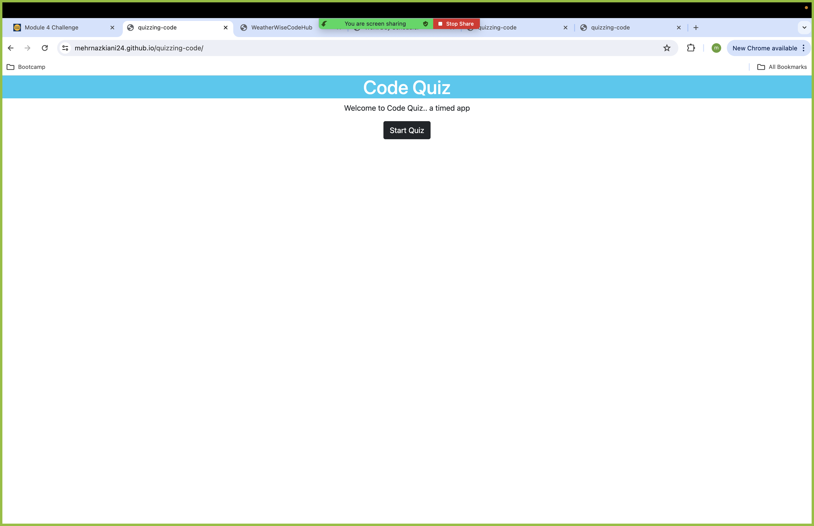
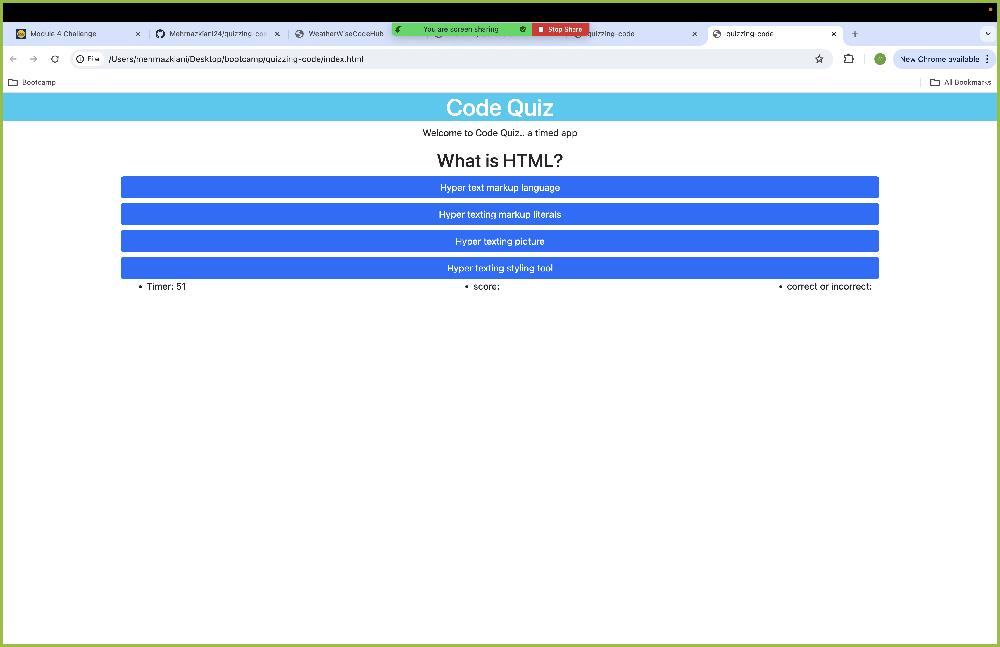
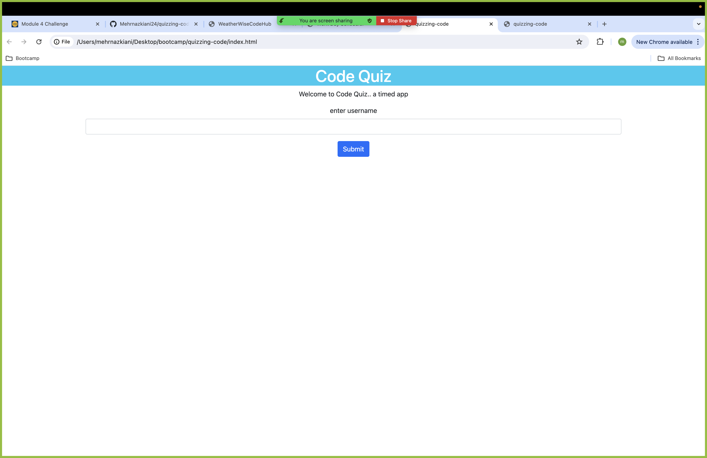

# quizzing-code
I want to take a timed quiz on JavaScript fundamentals that stores high scores
SO THAT I can gauge my progress compared to my peers.

## usage
1. Open the application using [application](https://mehrnazkiani24.github.io/quizzing-code/).
2. click on start quiz to being. 
3. Answer questions before timer runs out. 
4. Complete all questions. 
5. At the end enter user infomation to save your score record. 

## ScreenShots

## Project Links 
<ul>
<li>
[liveApplication](https://mehrnazkiani24.github.io/quizzing-code/)
</li>
<li>
[GitHub](https://github.com/Mehrnazkiani24/quizzing-code/)
</li>
</ul>